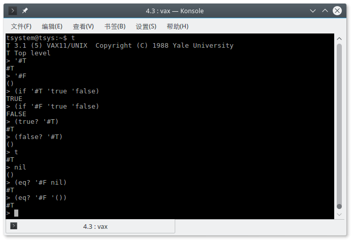
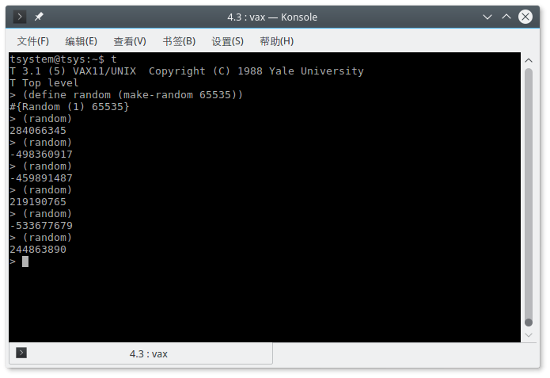
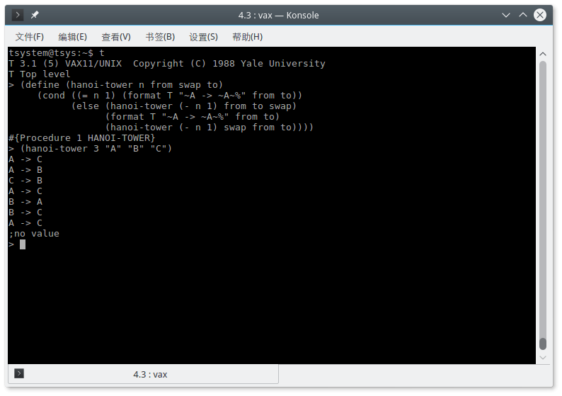

# The T programming language

The T programming language is a early dialect of LISP and Scheme. Originally developed at Yale University. 

See also: [wikipedia](https://en.wikipedia.org/wiki/T_(programming_language))

          [T Project](http://mumble.net/~jar/tproject/)
          
The T system has been ported to many different systems and architectures but not X86. so when we want to try it, we have to use the simulator.

Screenshots:

          
# Try it
          
## Step 0. Install all dependent libraries

  Such as libpcap, libpcap-dev, if you need network support.

## Step 1. Build SIMH
    git clone https://github.com/uternet/language-t.git
    cd language-t
    7z x ultrix-4.3.7z
    git clone https://github.com/simh/simh.git
    cd simh
    make vax                   # build vax only, or `make` for all machines
    cp BIN/vax ../ultrix-4.3/  # copy the executable to ultrix's directory
                               # or $PATH directories
    
## Step 2 Create a tap interface

  See '0readme_ethernet.txt'

## Step 3. Run the simulator

    cd ultrix-4.3
    ./vax vax.ini  # a configuration file `vax.ini` already exists
    
## Step 4. Boot the system

    boot cpu    # power on the machine
      show dev  # show all devices, such hard disk, tape drives ...
    boot dua0   # boot from hard disk

## Step 5. Login System

  username: tsystem
  
  password: tsystem
    
  password for root: iamgold
  
**IMPORTANT:** The system must be shutdown normally, after OS shutdown, the machine is not really power off, you must exit SIMH shell by command 'exit'. Do not close the console window directly. Otherwise you may not be able to start the system again. 

Compressing and backing up the virtual hard disk 'd0.dsk' and 'd1.dsk' may be a good idea.
